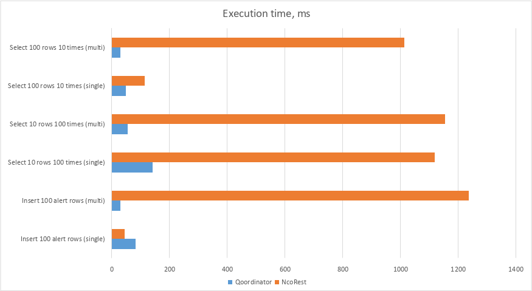
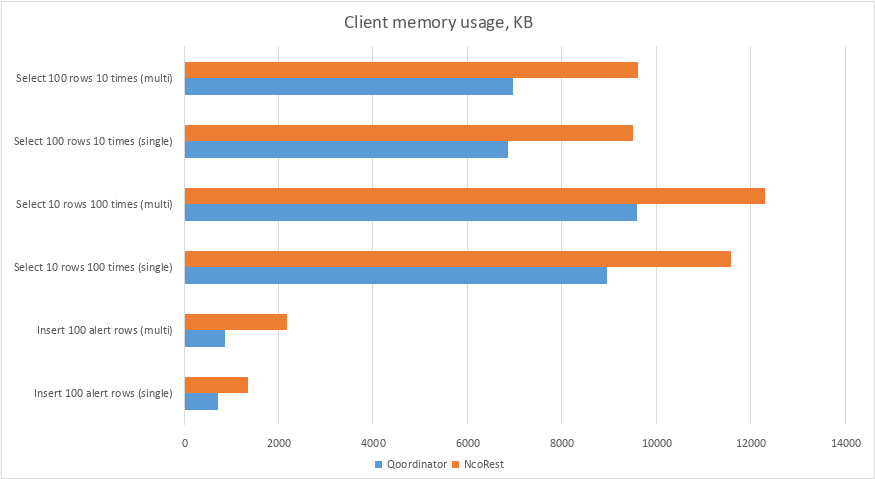

# Benchmark Suite Comparison

## Overview

This document compares the performance benchmarks of two packages: `qoordinator` and `ncorest`. 
The `qoordinator` is a client for nco-qoordinator server (`ncoq-api`) and `ncorest` is a client for the native 
[Netcool OMNIbus REST API](https://www.ibm.com/docs/en/netcoolomnibus/8.1?topic=interface-overview).

The benchmarks are run on the same hardware and environment, with results measured for different scenarios.

## Scenarios

- insert 100 random generated rows into `alert.status` table
  - single: `BenchmarkQoordinatorInsert_SingleThread_100rows-8`
  - multi: `BenchmarkQoordinatorInsert_MultiThread_100rows-8`
- 100 times select rows from `alerts.status`, each request returns 10 rows
  - single: `BenchmarkQoordinatorSelect_SingleThread_10rows_100repeat-8`
  - multi: `BenchmarkQoordinatorSelect_MultiThread_10rows_100repeat-8`
- 10 times select rows from `alerts.status`, each request returns 100 rows
  - single: `BenchmarkQoordinatorSelect_SingleThread_100rows_10repeat-8`
  - multi: `BenchmarkQoordinatorSelect_MultiThread_100rows_10repeat-8`

`Single` means that there is only one API-client. 

`Multi` - there are a few clients that share work: for instance, 100 inserts by 10 clients, each one makes 10 queries. 

## System Information

- **Operating System**: Linux
- **Architecture**: amd64
- **CPU**: 12th Gen Intel(R) Core(TM) i7-1260P

Two OMNIbus Object Servers are running inside docker containers with 4 CPUs and 2GiB memory in each one:

```bash
CONTAINER ID   NAME                       CPU %     MEM USAGE / LIMIT   MEM %     NET I/O          BLOCK I/O   PIDS
9deb08e18ee8   nco_objserver-omnibus1-1   0.04%     43.05MiB / 2GiB     2.10%     225MB / 1.17GB   0B / 0B     46
f50f0b2cab1c   nco_objserver-omnibus0-1   0.05%     43.37MiB / 2GiB     2.12%     225MB / 1.17GB   0B / 0B     46
```

## Benchmarks

### Comparison

Execution time per benchmark iteration in ms, less is better.



Memory used by client per benchmark iteration in KB, less is better.



### `qoordinator`

| Benchmark | Iterations | Time (ns/op) | Memory (B/op) | Allocations (allocs/op) |
|----|----|----|----|----|
| BenchmarkQoordinatorInsert_SingleThread_100rows-8          | 16 |   74541024 |   723079 |   8011 |
| BenchmarkQoordinatorInsert_MultiThread_100rows-8           | 51 |   19699961 |   844090 |   8616 |
| BenchmarkQoordinatorSelect_SingleThread_10rows_100repeat-8 |  8 |  127185180 |  9192221 | 123349 |
| BenchmarkQoordinatorSelect_MultiThread_10rows_100repeat-8  | 20 |   80436158 |  9797702 | 123547 |
| BenchmarkQoordinatorSelect_SingleThread_100rows_10repeat-8 | 13 |   89617775 |  7055725 | 110168 |
| BenchmarkQoordinatorSelect_MultiThread_100rows_10repeat-8  | 21 |   55155336 |  7129276 | 110171 |

### `ncorest`

| Benchmark | Iterations | Time (ns/op) | Memory (B/op) | Allocations (allocs/op) |
|----|----|----|----|----|
| BenchmarkNcoRestInsert_SingleThread_100rows-8              | 27 |   42047663 |  1392207 |  15932 |
| BenchmarkNcoRestInsert_MultiThread_100rows-8               |  1 | 1160987282 |  2223800 |  18377 |
| BenchmarkNcoRestSelect_SingleThread_10rows_100repeat-8     |  1 | 1084616762 | 11698496 | 126670 |
| BenchmarkNcoRestSelect_MultiThread_10rows_100repeat-8      |  1 | 1187623425 | 12954056 | 129571 |
| BenchmarkNcoRestSelect_SingleThread_100rows_10repeat-8     | 10 |  109866266 |  9700274 | 110611 |
| BenchmarkNcoRestSelect_MultiThread_100rows_10repeat-8      |  1 | 1098730684 |  9875128 | 111479 |
